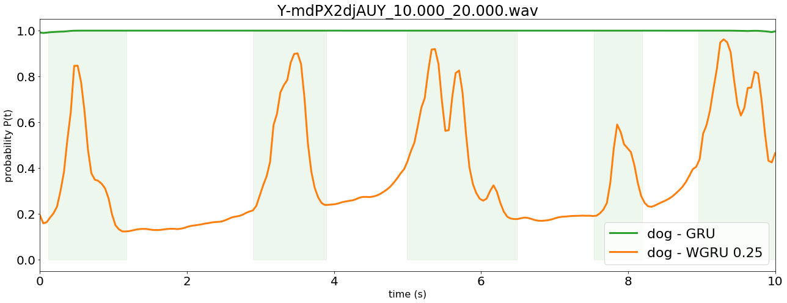

# Entry to the DCASE 2018 task 4 (Large-scale weakly labeled semi-supervised sound event detection in domestic environments) challenge
Based on Convolutional Recurent Neural Network. Tensorflow / Keras

## About the challenge
To get information about the challenge, please visit its
[Website](http://dcase.community/challenge2018/task-large-scale-weakly-labeled-semi-supervised-sound-event-detection).
The purpose was to propose a solution to a classification and localization task of multiple sound events in domestics environments. 10 classes describe these events and an audio file can be tagged with multiple class, sometimes
 overlapping. (weak annotation)

## Requirements
```
conda create -n dcase python=3.5 pip
conda activate dcase
pip install scikit-learn
pip install dcase_util
pip install sed_eval
pip install tensorflow-gpu
pip install keras
```

## Usage
#### Main arguments
 * **--normalizer** Normalization method to apply on data before training [file_MinMax | global_MinMax |
  file_Mean | global Mean | file_standard | global_standard | unit ]
 * **--output_model** Basename of the models to save
 * **--meta_root** Path to meta files location (root)
 * **--features_root** Path to feature files location (root)
 * **-uid** Use the *unlabel in domain* subset to retrain first model and perform adaptation
 * **-retrain** Force the program to retrain the model even if it already exist
 * **-w** If set, display hidden warnings

```
conda activate dcase
python main.py --output_model results/model.name --meta_root path/to/meta/root --features_root path/to/features/root -uid
```


## Weighted Gate Recurent Unit (WGRU)
To achieve the current score, a Weighted Gate Recurrent Unit (WGRU) was used in parallel with a  classic Gate Recurrent Unit (GRU). The GRU has a good performance when it comes to "stationary" sound localization whereas the WGRU perform better with punctual sounds such as *speech*, *dog*, *alarm bell* and *cat*.

Weight injection in the GRU layer      | Weight impact on localization
---------------------------------------|---------------------------------------------
 | 