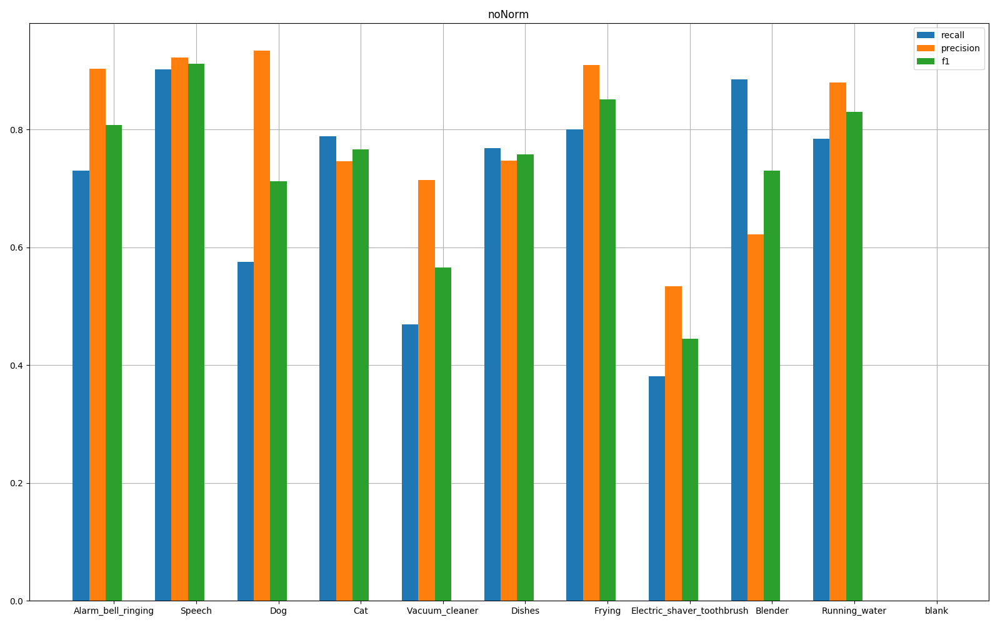
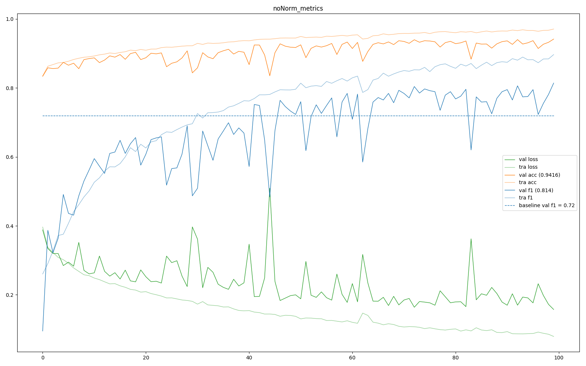

# Parsing the results

I developed my own visualization system for the metrics used in that system.

## Usage
Note that log files written by the callback must be in the same directory
```
cd results
python parse_all.py
```

## detail
`parse_metrics.py` will plot the curves corresponding to:

 * The loss and val_loss respectively in light green and green;
 * The accuracy and val_accuracy respectively in light orange and orange;
 * The f1 and val_f1 respectively in light blue and blue.
 
`parse_detail.py` will plot a bar graph representing the precision; recall
independently for each class. the closest it goes to 1, the better it is.
 
## expample
 
parse_detail.py example output            | parse_metrics.py example output
------------------------------------------|---------------------------------------------
 | 

